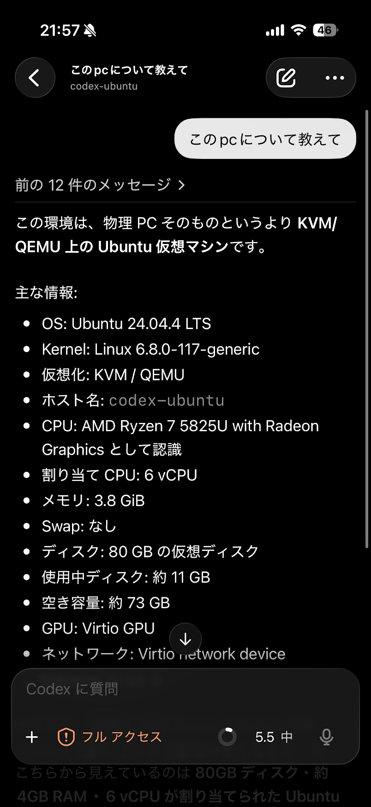
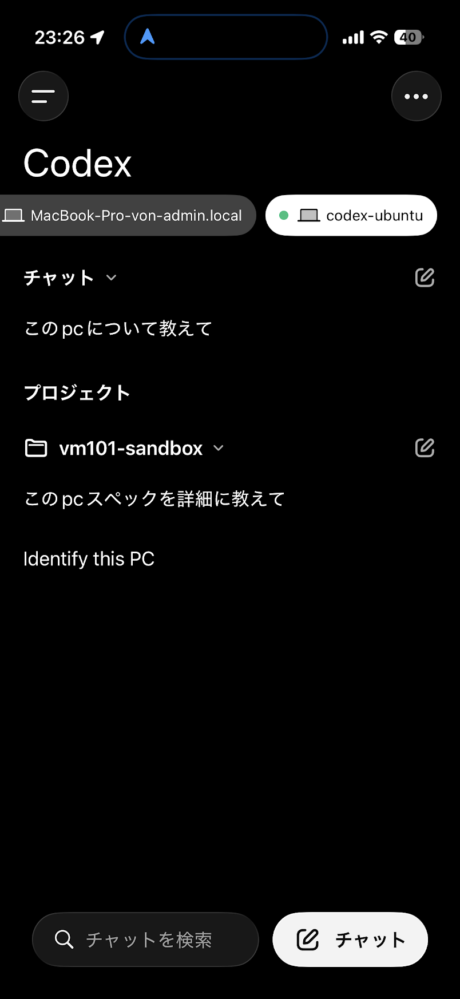
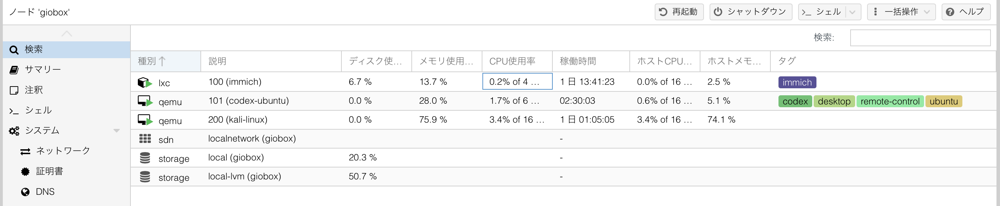
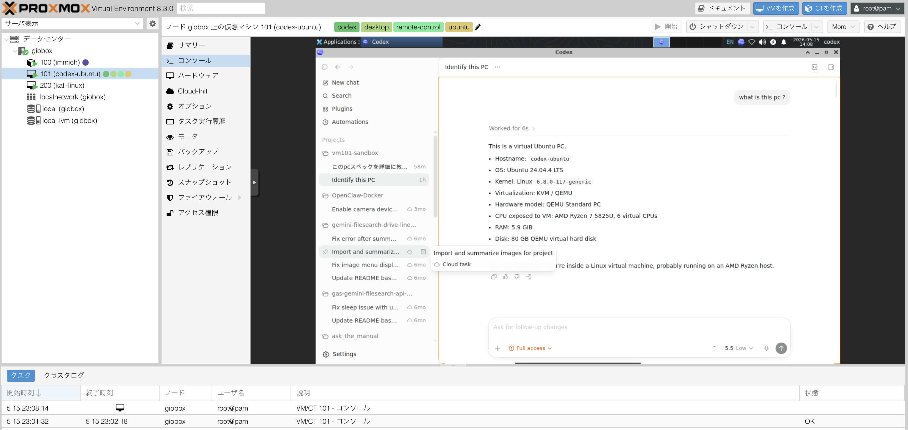

<p align="center">
  
</p>

<h1 align="center">Codex Mobile Remote Control VM</h1>

<p align="center">
  A Codex Skill for turning an SSH-only Ubuntu VM into a Codex Desktop host that can be controlled from the ChatGPT/Codex mobile app.
</p>

<p align="center">
  <a href="README.ja.md">日本語</a> | <a href="README.md">English</a>
</p>

<p align="center">
  <a href="https://github.com/Sunwood-ai-labs/codex-mobile-remote-control-vm/actions/workflows/ci.yml"></a>
  <a href="https://github.com/Sunwood-ai-labs/codex-mobile-remote-control-vm/actions/workflows/deploy-docs.yml"></a>
  <a href="https://github.com/Sunwood-ai-labs/codex-mobile-remote-control-vm/releases/tag/v0.1.0"></a>
  
  
  
</p>

## ✨ What This Skill Does

This repository packages a reusable Codex Skill for building and repairing Ubuntu desktop VMs that are meant to be remote-controlled from mobile.

It covers the full handoff path:

- Proxmox or SSH-accessible Ubuntu VM inventory
- XFCE/LightDM desktop setup so noVNC shows a real GUI instead of only `tty1`
- Codex Desktop Linux-port launch and restart flow
- `remote_connections` and `remote_control` feature configuration
- mobile app sign-in and remote-control verification
- diagnostics for disappearing Connections rows and empty `connectionCount=0` logs

The primary success criterion is not that the Linux desktop Connections panel looks perfect. The key proof is that the ChatGPT/Codex mobile app can open and control the VM-backed Codex Desktop session.

## 🚀 Install

Clone or copy this repository into your Codex skills directory:

```bash
mkdir -p "$HOME/.codex/skills"
git clone https://github.com/Sunwood-ai-labs/codex-mobile-remote-control-vm.git \
  "$HOME/.codex/skills/codex-mobile-remote-control-vm"
```

Restart Codex Desktop or start a new Codex session so the skill registry refreshes.

## 🧭 Use

Ask Codex for a mobile remote-control VM setup, for example:

```text
Ubuntu VMでCodex Desktopをスマホ mobile からremote controlできるようにセットアップして
```

The skill entry point is [SKILL.md](SKILL.md). The operational runbook is [references/runbook.md](references/runbook.md).

## 📚 Documentation

Browsable documentation is available at:

<https://sunwood-ai-labs.github.io/codex-mobile-remote-control-vm/>

- [v0.1.0 Release Notes](https://sunwood-ai-labs.github.io/codex-mobile-remote-control-vm/guide/releases/v0.1.0)
- [Mobile remote-control walkthrough](https://sunwood-ai-labs.github.io/codex-mobile-remote-control-vm/guide/articles/mobile-remote-control-vm-v0.1.0)

Local docs preview:

```bash
cd docs
npm ci
npm run docs:dev
```

## 🖼️ Setup Proof

The screenshots below show the actual Proxmox VM setup used to validate this Skill. The mobile screenshots are the most important proof surface: they show the VM-backed Codex Desktop session being controlled from a phone.

<table>
  <tr>
    <td width="50%">
      
    </td>
    <td width="50%">
      
    </td>
  </tr>
</table>





## 🩺 Audit A VM

After installing the skill, run the read-only audit script against an SSH alias or host:

```bash
./scripts/audit-codex-remote-vm.sh codex-ubuntu
```

The audit checks desktop services, GUI session state, Codex config, app-server feature flags, remote-control enrollment, and recent Codex Desktop logs.

## 🖥️ Create A Desktop Shortcut

After the VM has a stable launcher, create the GUI desktop shortcut with:

```bash
ssh codex-ubuntu 'bash -s' < scripts/create-codex-desktop-shortcut.sh
```

This creates `~/Desktop/Codex Desktop.desktop` and `~/.local/share/applications/codex-desktop.desktop`, marks the desktop entry executable, and sets the trusted metadata when `gio` is available.

## 🧩 Repository Layout

```text
.
├── SKILL.md                         # Codex Skill entry point
├── README.md                        # English public README
├── README.ja.md                     # Japanese public README
├── agents/openai.yaml               # Codex skill registry metadata
├── references/runbook.md            # Detailed setup and troubleshooting guide
├── docs/                            # Bilingual VitePress documentation
├── scripts/audit-codex-remote-vm.sh # Read-only VM health audit
├── scripts/create-codex-desktop-shortcut.sh # GUI shortcut helper
└── scripts/validate.sh              # Local repository validation
```

## ✅ Validation

Run:

```bash
./scripts/validate.sh
```

The validation checks:

- Skill metadata and required files
- Codex skill quick validation when available
- shell syntax for helper scripts
- README references to core files
- VitePress docs build when Node dependencies are installed

## 🔐 Safety Notes

- Do not store GUI passwords, account credentials, tokens, or VM secrets in this repository.
- Treat mobile control as the final proof surface. UI rows in the Linux port can be misleading.
- Avoid making `~/.codex/config.toml` immutable except during short diagnosis.

## 📄 License

MIT License. See [LICENSE](LICENSE).
