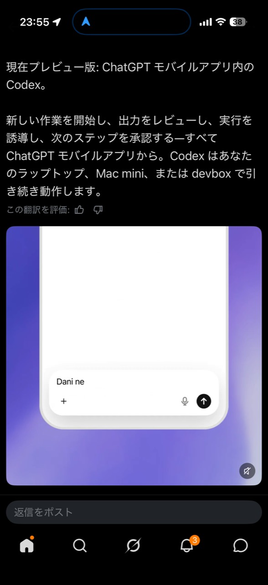

# ChatGPTモバイルアプリのCodexから、Proxmox上のUbuntu VMを操作できた話

> 2026年5月15日のアップデートで触れるようになったChatGPTモバイルアプリ内のCodexから、Proxmox上のUbuntu VMで動くCodex Desktopへ接続し、実際にリモート制御できるところまで確認しました。

これはかなり大きいです。

スマホからAIに質問できる、という話ではありません。スマホからCodexを開き、その先にあるCodex Desktopを通じて、実際のPC環境を操作できる。しかも今回は、手元のMacではなく、Proxmox上に立てたUbuntu VMまで届きました。

つまり、モバイルアプリが「チャットの入口」ではなく、「実作業マシンを遠隔操作する入口」になり始めています。

さらに、このセットアップをその場限りで終わらせず、Codexエージェントが次回からセットアップや修復まで案内できるSkillとして整理し、OSSとして公開しました。つまり、記事で紹介する構成は「できた」という実験ログであると同時に、他の環境でも再現しやすいエージェント用の手順パッケージでもあります。

- Repository: <https://github.com/Sunwood-ai-labs/codex-mobile-remote-control-vm>
- Docs: <https://sunwood-ai-labs.github.io/codex-mobile-remote-control-vm/>
- Release: <https://github.com/Sunwood-ai-labs/codex-mobile-remote-control-vm/releases/tag/v0.1.0>

## 今日のアップデートで見えたもの

今回の入口になったのは、ChatGPTモバイルアプリ内に表示されたCodexのプレビュー機能です。



画面には、モバイルアプリから新しい作業を開始し、出力をレビューし、実行を誘導し、次のステップを承認できることが示されています。さらに、Codexはラップトップ、Mac mini、devboxなどで引き続き動作する、という説明があります。

ここで重要なのは、接続先が「手元の1台」に閉じないことです。

Codex Desktopが動く環境を用意できれば、その環境はモバイルアプリから操作対象になりえます。今回はその接続先として、Proxmox上のUbuntu VMを使いました。

## 何を実現したのか

今回のゴールは、SSHだけで触れるUbuntu VMを、スマホから操作できるCodex Desktopホストにすることでした。

流れはこうです。

1. Proxmox上にUbuntu VMを用意する
2. CLIだけだったVMにXFCE/LightDMのデスクトップ環境を入れる
3. ProxmoxのnoVNCコンソールからGUIログインできるようにする
4. VM内でCodex Desktopを起動する
5. Codexのremote control系featureを有効にする
6. 同じアカウントでChatGPT/Codexモバイルアプリから接続する
7. スマホからVM上のCodex Desktopセッションを制御する

この流れを、Codexエージェントが再利用できるSkillとしてOSS化しています。人間が毎回手順を思い出すのではなく、エージェントに「このUbuntu VMをスマホからremote controlできるCodex Desktopホストにして」と頼める状態を目指しました。

一番アピールしたいのは最後です。

スマホから、Proxmox上のUbuntu VMに入っているCodex Desktopを制御できました。これはつまり、Codex Appが見ている実作業PCを、さらにモバイルから操作できるということです。

## Proxmox上のUbuntu VMでCodex Desktopが動く

セットアップ後、Proxmoxのコンソール上ではUbuntu VMの中でCodex Desktopが動いています。


VMには `codex`, `desktop`, `remote-control`, `ubuntu` のタグも付けました。あとから見ても、このVMが「Codex Desktopをスマホ制御するための環境」だと分かります。


## 本命はスマホからの制御

そして、今回いちばん大事な証跡がこれです。

<table>
  <tr>
    <td width="50%">
      
    </td>
    <td width="50%">
      
    </td>
  </tr>
</table>

スマホ側から、VM上のCodex Desktopセッションを開いて操作できています。

ここで起きていることを分解すると、かなり面白いです。

- 物理ホストはProxmoxを動かしているPC
- その上にUbuntu VMがある
- Ubuntu VMの中でCodex Desktopが動いている
- ChatGPT/Codexモバイルアプリから、そのCodex Desktopへ接続している
- 結果として、スマホからVM上の実作業環境を操作できている

これは、単なるリモートチャットではありません。実際のPC上で動くCodex Appを、スマホから遠隔操作する構成です。

## 何が嬉しいのか

この構成が嬉しいのは、作業環境を「スマホの外」に置けることです。

スマホ単体では、重いビルド、ローカルファイル編集、GUIアプリ操作、VM管理、長時間のセットアップなどはやりづらいです。でも、実作業はUbuntu VM側に置き、スマホは指示と承認の端末として使うなら話が変わります。

たとえば次のような使い方が見えてきます。

- 外出先から自宅LabのVMへ作業を投げる
- Proxmox上の検証環境をスマホから確認する
- Codex DesktopにGUI操作やローカル検証を任せる
- 作業の途中結果をスマホでレビューして承認する
- Mac miniやdevboxだけでなく、自分で作ったUbuntu VMを作業ノードにする

スマホが強力な開発マシンになる、というより、スマホが強力な開発マシン群への操作盤になる感覚です。

## ハマりどころはGUIとConnections表示

もちろん、SSHだけのUbuntu VMにそのままCodex Desktopを入れて終わり、とはいきませんでした。

まず、CLIだけのVMではProxmoxのコンソールに `tty1` のログイン画面しか出ません。Codex Desktopを実用するには、軽量なデスクトップ環境を入れて、noVNC越しにもGUIが見えるようにする必要があります。

今回はXFCEとLightDMを使って、Ubuntu VMをGUIログインできる状態にしました。

さらに、Codex側では次のfeature設定を入れています。

```toml
[features]
remote_connections = true
remote_control = true
workspace_dependencies = false
```

もう一つ大事なのが、Linux版Codex DesktopのConnections画面です。

この画面は、状態表示が少し分かりづらいことがあります。デバイス行が一瞬見えたあと消えたり、Linux側の表示だけを見ると成功しているのか判断しづらい場面がありました。

そのため、今回のセットアップでは「Linux側のConnections画面がきれいに見えるか」ではなく、「スマホから実際にVM上のCodex Desktopを操作できるか」を最終的な成功条件にしました。

## エージェント用SkillとしてOSS化した

このセットアップは、一度うまくいっただけではもったいないです。

VMの作成、GUI化、Codex Desktop起動、feature設定、モバイル接続、トラブルシュートまで、手順として残さないと次回また同じところで迷います。

そこで、今回の一連の作業をCodex Skillとしてまとめ、OSSリポジトリとして公開しました。

このSkillは、単なるメモではなく、Codexエージェントが実際のセットアップ作業を進めるための入口です。たとえば、次のような作業をエージェントに任せやすくします。

- ProxmoxまたはSSH可能なUbuntu VMの棚卸し
- CLIだけのVMにGUI環境を入れる、または修復する
- Codex Desktopの起動経路を整える
- `remote_connections` と `remote_control` のfeature設定を入れる
- モバイルアプリから制御できるかを確認する
- うまくいかない場合にログやenrollment状態を見る

OSSにしているので、同じようなVM環境を持っている人が、そのままcloneして自分のCodex Skillとして使えます。

```bash
mkdir -p "$HOME/.codex/skills"
git clone https://github.com/Sunwood-ai-labs/codex-mobile-remote-control-vm.git \
  "$HOME/.codex/skills/codex-mobile-remote-control-vm"
```

導入後は、Codexにこう頼めます。

```text
Ubuntu VMでCodex Desktopをスマホ mobile からremote controlできるようにセットアップして
```

Skill側では、VMの棚卸し、GUI環境、Codex設定、mobile control確認、ログ確認までをひとつの流れとして扱います。

ここが今回のもう一つのポイントです。モバイルCodexの可能性を試しただけでなく、その接続先になるUbuntu VMをエージェント自身が整備しやすい形にしたことで、「スマホから作業環境へ入る」までの再現性が上がりました。

## 監査スクリプトも用意した

再現性を上げるために、読み取り専用の監査スクリプトも入れています。

```bash
./scripts/audit-codex-remote-vm.sh codex-ubuntu
```

確認するのは、だいたいこのあたりです。

- desktop service
- GUI session
- Codex config
- app-server feature flags
- remote-control enrollment
- Codex Desktop logs

「スマホから見えない」「Connections行が消えた」「Codex Desktopは起動しているのに制御できない」といったときの入口になります。

## この先の可能性

今回できたことは、かなり素直に拡張できます。

接続先がProxmox上のUbuntu VMでよいなら、用途別に複数の作業VMを用意できます。

- 検証用Ubuntu VM
- GPU付きの実験VM
- GUIアプリ操作用VM
- セキュリティ検証用Lab VM
- 長時間タスクを投げるdevbox

それぞれにCodex Desktopを入れておけば、スマホから必要な作業環境へ入り、Codexに作業を進めてもらい、重要なタイミングだけ人間が承認できます。

これは「PCの前に座ってCodexを使う」から一歩進んで、「どこからでも自分の作業環境群をCodex経由で動かす」に近い体験です。

## まとめ

今回の成果は、ChatGPTモバイルアプリ内のCodexから、Proxmox上のUbuntu VMに接続し、VM内で動くCodex Desktopを実際に制御できたことです。

スマホからAIに相談するだけではなく、スマホから実作業PCを動かす。

この差はかなり大きいです。

Codex Appが実際のPCを制御できるなら、そのCodex Appをモバイルから制御することで、スマホは作業環境全体へのリモコンになります。Proxmox、Ubuntu VM、Codex Desktop、ChatGPTモバイルアプリがつながると、開発環境や検証環境の扱い方がかなり変わりそうです。

今回のリポジトリとSkillは、そのための最初の再現可能なセットアップとして公開しています。エージェントがセットアップを手伝い、スマホが承認と操作の入口になり、実作業はProxmox上のUbuntu VMで進む。この組み合わせは、かなり実用的なリモート作業基盤になりそうです。
